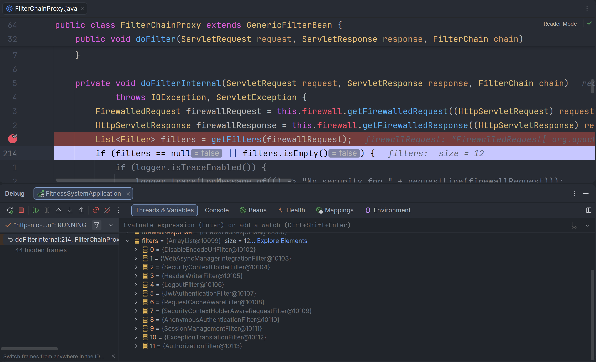

SpringSecurity学习

SpringSecurity6.5.7默认有15个过滤器链条，但通过配置之后，具体过滤器链条数量会减少，如图所示。

过滤器顶层类是FilterChainProxy，在方法doFilterInternal可以看到获取多少过滤器



# 异常体系设计

## 1. 异常抛出原则

### 1.1 两条异常谱系

1. **第三方库异常（io.jsonwebtoken）**

```JwtException（RuntimeException）```

- ExpiredJwtException
- SignatureException
- MalformedJwtException

> ⚠️ **外部依赖异常，属于底层实现细节，绝对不能暴露给上层 Filter**

2. **SpringSecurity 标准认证异常（org.springframework.security.core.AuthenticationException）**

```AuthenticationException（RuntimeException，安全体系顶级异常）```

- CredentialsExpiredException：凭证过期（你的 Token 过期场景）
- BadCredentialsException：凭证无效、签名错误、篡改、格式错误

> ✅ **框架约定异常，ExceptionTranslationFilter、EntryPoint 天然识别这一族异常**

### 1.2 如何抛异常

#### 问题一：Parser/Provider 该不该抛 AuthenticationException 子类？

第一类：`JwtTokenParser`【重点】解析器 ✅ 转换为 AuthenticationException，例如：

职责：接收原始 token 字符串 → 调用 JJWT 解析验签 → **捕获 JJWT 的`JwtException`，转换为 SpringSecurity 标准异常向外抛出**

```java
// JwtTokenParser伪代码示例
public AccessTokenClaims parseAccessToken(String token) {
    try {
        Jws<Claims> jws = parserBuilder.build().parseSignedClaims(token);
        // 转换Claims为AccessTokenClaims并返回
    } catch (ExpiredJwtException e) {
        log.warn("Token过期 ...");
        throw new CredentialsExpiredException("访问凭证已过期", e);
    } catch (SignatureException | MalformedJwtException e) {
        log.warn("Token非法/被篡改 ...");
        throw new BadCredentialsException("无效访问凭证", e);
    } catch (JwtException e) {
        throw new BadCredentialsException("凭证解析失败", e);
    }
}
```

#### 为什么 Parser 在这里转换？

1. **封装底层依赖**：上层完全不需要 import 任何 `io.jsonwebtoken`；
2. **单一职责**：解析器负责「识别 JWT 各类错误 → 翻译成标准认证错误」；
3. 输出契约统一：调用 Parser 的上层，只需要处理 `AuthenticationException`。


第二类：`JwtTokenProvider` 生成器 ❌ 不要抛出 AuthenticationException

它只负责**签发 Token**，正常场景不会校验失败；

如果出现错误（密钥错误、参数非法），属于**服务内部配置异常**，不是「客户端认证失败」。

应当抛出普通运行时异常（自定义基础设施异常 `InfraException`），这类异常最终会进入`GlobalExceptionHandler`，返回 500。

> 区分：
>
> 客户端传错 Token → 认证失败（401，AuthenticationException）
>
> 服务器密钥配置错误无法生成 Token → 服务内部故障（500）


### JwtException异常捕获和对应AuthenticationException抛出

```
# JwtException
ExpiredJwtException
PrematureJwtException
SignatureException
MalformedJwtException
UnsupportedJwtException
MissingClaimException / IncorrectClaimException（ClaimJwtException 子类）
```

# 逐个场景：触发条件 + 映射 SpringSecurity 异常

> SpringSecurity 认证异常家族
>
> - `CredentialsExpiredException`：凭证有效，但是过期 ✅（专门区分过期场景）
> - `BadCredentialsException`：凭证无效、错误、篡改、格式非法 ✅（最通用）
> - `AuthenticationServiceException`：认证服务内部异常（极少用）

## 1. ExpiredJwtException

**触发时机**

Token 签名合法，当前时间 > `exp` 过期时间。

> 重要特性：`e.getClaims()` **可以拿到载荷信息**。

**映射抛出：`CredentialsExpiredException`**

理由：

凭证本身是合法签发的，只是生命周期到期；你在 `JwtAuthenticationEntryPoint` 靠这个类型区分，返回「TOKEN 已过期」，引导前端刷新 token，而不是单纯提示令牌非法。

```
catch (ExpiredJwtException e) {
    log.warn("AccessToken已过期,jti={}", e.getClaims().getId());
    throw new CredentialsExpiredException("访问凭证已过期", e);
}
```

## 2. PrematureJwtException

**触发时机**

签名合法，当前时间 < `nbf`（Not Before），令牌还未生效。

一般是客户端时间异常、或者刚签发立刻使用。

**映射抛出：`BadCredentialsException`**

java


运行


```
catch (PrematureJwtException e) {
    throw new BadCredentialsException("令牌尚未生效", e);
}
```

## 3. SignatureException

**触发时机**

签名校验失败：密钥不一致、Token 被篡改。

> ⚠️ 这个异常**无法获取有效 Claims**，不要尝试读取 payload！

**映射抛出：`BadCredentialsException`**

提示：无效凭证，不要区分 “被篡改” 对外暴露细节。

## 4. MalformedJwtException

**触发时机**

token 字符串格式错误：少 `.`、乱字符串、不是三段式 JWS。

例：`abc123`、缺少分段的残缺 token。

**映射抛出：`BadCredentialsException`**

## 5. UnsupportedJwtException

**触发时机**

不支持的算法、不是 JWS（加密 JWE）、头部 alg 不识别。

**映射抛出：`BadCredentialsException`**

## 6. MissingClaimException / IncorrectClaimException（ClaimJwtException 子类）

**触发时机**

你开启了 `requireIssuer()、requireAudience()` 等校验；

- MissingClaim：缺失必填声明
- IncorrectClaim：aud/iss 和预期不匹配

**映射抛出：`BadCredentialsException`**

## 7. 其余所有 JwtException 兜底分支

KeyException、CodecException、CompressionException、SerialException……

统一捕获 `JwtException`，抛出 `BadCredentialsException`。

> 区分：这些属于底层解析 / 密钥异常，统一归类为令牌解析失败。


Jwt 过滤器抛出 `CredentialsExpiredException`

`ExceptionTranslationFilter` 捕获 → 调用一次 `commence()`（此时异常是过期凭证）

⚠️ **ExceptionTranslationFilter 捕获异常后，不会终止过滤器链！方法正常走完，继续向后执行**

流程继续走到 **`AuthorizationFilter`**

`SecurityContext` 是空（你的 finally 清理了上下文），授权管理器拿到匿名 / 空认证

`AuthorizationFilter` 抛出 **`AuthorizationDeniedException`**（不是 Insufficient！）

异常再次向上抛回 `ExceptionTranslationFilter`，进入 `handleSpringSecurityException`


# 用户中心模块

**DDD Lite 下的用户中心（User Context）如何设计聚合不同身份扩展信息的问题**。

> `/api/user/profile` 放在 user 模块，而不是 auth 模块。

因为：

- auth 负责：
  - 登录
  - token
  - session
  - 权限认证
- user 负责：
  - 用户基本资料
  - 用户扩展资料
  - 修改个人信息

## 1. 先明确你的领域模型

你现在的数据模型实际上是：

```
                 sys_user
                    |
        -------------------------
        |                       |
 student_info             teacher_info
```

这是典型：

> 用户核心 + 用户类型扩展表

类似：

```
User
 |
 +-- StudentProfile
 |
 +-- TeacherProfile
```

所以你的 domain 不应该设计成：

```
User {
 username
 password
 studentNo
 teacherNo
 major
 classId
}
```

这样以后会越来越乱。

应该保持：

```
User
 |
 |-- userId
 |-- campusId
 |-- username
 |-- nickname
 |-- userType
 |
 + StudentProfile
 |
 + TeacherProfile
```

------

# 2. user 模块结构建议

你现在：

```
user
├── application
├── domain
├── infrastructure
└── interfaces
```

保持即可。

建议调整：

```
user
|
├── application
│
│   ├── service
│   │    ├── UserProfileApplicationService.java
│   │    └── impl
│   │
│   └── dto
│        ├── UserProfileDTO.java
│        └── UpdateProfileCommand.java
│
├── domain
│
│   ├── model
│   │
│   │    ├── User.java
│   │    ├── StudentProfile.java
│   │    └── TeacherProfile.java
│   │
│   └── port
│        └── UserProfileRepository.java
│
├── infrastructure
│
│   └── persistence
│        |
│        ├── entity
│        │
│        ├── mapper
│        │
│        └── repository
│
└── interfaces
    |
    └── web
         |
         ├── UserProfileController.java
         └── dto
```

# 3. Controller设计

接口：

```
GET

/api/user/profile


PUT

/api/user/profile
```

Controller：

```
@RestController
@RequestMapping("/api/user")
@RequiredArgsConstructor
public class UserProfileController {


    private final UserProfileApplicationService service;


    @GetMapping("/profile")
    public ApiResult<UserProfileDTO> profile(){

        return ApiResult.success(
                service.getCurrentUserProfile()
        );
    }


    @PutMapping("/profile")
    public ApiResult<Void> update(
            @RequestBody UpdateProfileCommand command
    ){

        service.updateProfile(command);

        return ApiResult.success();
    }

}
```

------

# 4. application层负责组装

重点：

这里就是你的业务编排层。

例如：

```
@Service
@RequiredArgsConstructor
public class UserProfileApplicationServiceImpl
        implements UserProfileApplicationService {


    private final UserProfileRepository repository;


    @Override
    public UserProfileDTO getCurrentUserProfile(){


        Long userId =
             LoginContext.getUserId();


        User user =
             repository.findUser(userId);


        switch(user.getUserType()){


            case STUDENT -> {

                StudentProfile student =
                    repository.findStudentProfile(userId);


                return UserProfileDTO.student(
                        user,
                        student
                );

            }


            case TEACHER -> {


                TeacherProfile teacher =
                    repository.findTeacherProfile(userId);


                return UserProfileDTO.teacher(
                        user,
                        teacher
                );

            }


            case ADMIN -> {


                return UserProfileDTO.admin(user);

            }

        }


        throw new BizException("未知用户类型");

    }


}
```

这里非常符合DDD Lite：

application：

> 决定流程

domain：

> 保存业务对象

infrastructure：

> 查数据库

------

# 5. Repository接口设计

domain:

```
public interface UserProfileRepository {


    User findUser(Long userId);


    StudentProfile findStudentProfile(
            Long userId
    );


    TeacherProfile findTeacherProfile(
            Long userId
    );

}
```

注意：

这里不要暴露：

```
SysUserMapper
StudentInfoMapper
```

这些属于基础设施。

------

# 6. infrastructure实现

例如：

```
@Repository
@RequiredArgsConstructor
public class UserProfileRepositoryImpl 
        implements UserProfileRepository {


private final SysUserMapper userMapper;

private final StudentInfoMapper studentMapper;

private final TeacherInfoMapper teacherMapper;


@Override
public User findUser(Long userId){

    SysUser entity =
       userMapper.selectById(userId);


    return UserConverter.toDomain(entity);

}


@Override
public StudentProfile findStudentProfile(Long userId){

    StudentInfo entity =
       studentMapper.selectByUserId(userId);


    return StudentConverter.toDomain(entity);

}


}
```

------

# 7. DTO设计

不要直接返回三个表。

返回：

```
@Data
public class UserProfileDTO {


    private Long userId;


    private String username;


    private String nickname;


    private Integer userType;


    private String avatar;


    /**
     * 学生信息
     */
    private StudentProfileDTO student;


    /**
     * 教师信息
     */
    private TeacherProfileDTO teacher;


}
```

例如学生：

```
{
 "userId":10001,
 "username":"20230001",
 "nickname":"张三",
 "userType":2,

 "student":{
    "studentNo":"20230001",
    "major":"软件工程",
    "classId":100
 }
}
```

教师：

```
{
 "userId":20001,
 "username":"t001",
 "nickname":"王老师",
 "userType":1,

 "teacher":{
    "teacherNo":"T001"
 }
}
```

管理员：

```
{
"userId":1,
"username":"admin",
"userType":0
}
```

------

# 8. 那权限怎么判断？

不要在 user 模块判断：

例如：

```
if(admin)
else if(student)
```

不要。

身份判断来自：

```
sys_user.user_type
```

权限判断来自：

```
RBAC

sys_role
sys_permission
```

这是两个东西。

例如：

学生访问：

```
GET /api/user/profile
```

只需要：

```
authenticated()
```

修改：

```
PUT /api/user/profile
```

也一样：

```
authenticated()
```

因为：

这是修改自己的资料。

------

# 9. 登录之后如何避免再次查询用户类型？

你的 JWT 已经有：

```
AccessTokenClaims

userId
campusId
username
```

可以增加：

```
userType
```

例如：

```
{
 userId:1001,
 username:"2023001",
 userType:2
}
```

这样：

Filter：

```
JwtUserPrincipal
```

里面：

```
private Integer userType;
```

然后：

```
/profile
```

可以直接：

```
LoginContext.getUserType()
```

减少一次查询。

------

# 10. 你现在数据库还有一个小问题

你的：

student_info:

```
UNIQUE KEY uk_user_deleted(user_id,deleted)
```

teacher_info:

```
UNIQUE KEY uk_user_deleted(user_id,deleted)
```

没问题。

但是建议加：

student：

```
KEY idx_class_id(class_id)
```

因为你的教师数据隔离：

```
teacher -> class -> student
```

以后一定查：

```
where class_id in (...)
```

否则20k数据没问题，大数据会慢。

# 登出功能

## 接口

## 业务

- 业务流程

```
1. 根据当前请求 token 解析出 Operator（campusId,userId）、当前设备 refreshTokenId
2. 删除该设备会话：refreshToken 映射、access 关联记录
3. 原子递增该用户的 tokenVersion（实现强制下线）# 这一步比单纯删缓存更关键，配合 JWT 内携带 version，旧 accessToken 立刻失效。
4. 登出同步删除权限缓存
```


