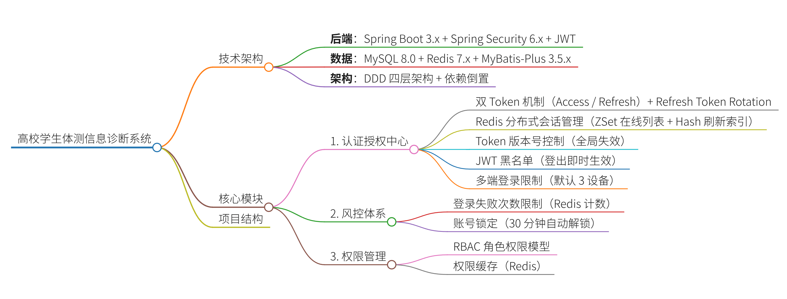

<h1><center>认证模块开发总结文档</center></h1>

# 一、登录接口

## 1.1 登录前置风控

### 1.1.1 核心要点

> 定位：**登录前置风控**（账号密码校验之前执行），拦截高频暴力猜密码、高频 `IP` 攻击；

两类限制：

-  **`IP 维度限制`**（防批量扫描、爬虫暴力试探大量账号）
- **账号维度限制**（同一个账号连续输错密码锁定）

技术底座：`Redis`（计数 + 过期，不需要落库，短时风控缓存；长期封禁再持久化数据库）

### 1.1.2 设计要点

#### 1.1.2.1 边界划分

- 触发时机：登录接口流程顺序：`接收请求 → **登录风控校验（前置）** → 账号密码校验 → 登录成功生成双 Token`

> 注意：❗不要放到密码校验之后；如果放后面，攻击者可以无限试探密码。

- 风控失败处理规范

  风控拦截返回：**不要明确区分「账号不存在 / 密码错误 / 被锁定」**

  安全原则：统一文案，防止攻击者枚举账号

  示例：`登录失败次数过多，请X分钟后重试`

#### 1.1.2.2 计数器设计

两种维度计数器，分开设计

1. 账号维度：账号连续错误计数器

   > \# 账号连续错误计数器（仅`username`，不带`campusId`）
   >
   > KEY示例：`auth:login:risk:username:{username}`
   >
   > value: 连续失败次数
   >
   > TTL：账号锁定时长，例如`15min`

   - 场景：同一账号多次输错密码 → 临时锁定账号

   - 规则示例：连续 5 次失败 → 锁定 15 分钟

   - 重置条件：**登录成功直接删除该 key**；锁定到期自动释放

   重要：只统计**密码校验失败**；风控拦截本身不计入密码错误次数！

2. `IP`维度：`IP` 访问频率限制

   > # `IP`限流（前置可用，无租户）
   >
   > KEY示例：`auth:login:risk:ip:{realIp}`
   >
   > value: 请求次数
   >
   > TTL：限流窗口，例如60s

   - 场景：单个 `IP` 短时间大量发起登录请求，扫描账号

   - 规则示例：1 分钟最多 20 次登录请求，超限封禁 `IP` 10 分钟

#### 1.1.2.3 注意点

1. **代理、`Nginx` 场景真实 `IP` 获取**：必须正确解析 `X-Forwarded-For`，否则风控全部失效；不要直接拿 `request.getRemoteAddr` ()
2. **防止 `Redis Key` 被恶意打爆**：所有风控 key 统一设置 TTL，禁止永不过期；
3. 原子操作！禁止 `查询→判断→incr` 三段式（并发竞态漏洞）
   - ✅ 使用 `Redis Lua / RedisTemplate boundOps` 原子自增
   - ❌ 先 get 次数，if 判断，再 `incr`：高并发下会突破阈值
4. 区分「风控拦截」和「密码错误」：风控拦截 ≠ 密码错误，不增加账号错误计数；只有到达密码校验环节、账号 / 密码不正确，才累加账号失败次数。
5. 不要永久锁定：全部采用**限时自动解锁**；永久锁定必须人工后台解封，避免运维灾难。
6. 多租户场景：key 必须带上 `campusId`！不同校园同名账号不能互相干扰。

#### 1.1.2.4 解锁策略设计

- 自动解锁：依靠 `Redis TTL` 过期

- 主动解锁：管理员后台手动清除风控缓存 key

- 用户侧：不提供自助解锁（可选增加验证码方案作为扩展）

### 1.1.3 `DDD Lite`设计

#### 1.1.3.1 模块划分建议

```
auth
├── domain
│   └── risk
│       ├── model
│       │   ├── LoginRiskRule      # 风控规则聚合（阈值、锁定时长配置）
│       │   ├── AccountLoginRecord # 账号风控状态（错误次数、锁定截止时间）
│       │   └── IpAccessRecord     # IP访问风控状态
│       ├── port
│       │   └── LoginRiskRepository # 仓储接口（读写风控计数）
│       └── service
│           └── LoginRiskDomainService # 领域内业务规则：判断是否锁定、计数递增规则
├── application
│   └── LoginApplicationService # 调用领域风控服务，前置校验
└── infrastructure
    └── risk
        └── LoginRiskRedisRepository # Redis实现仓储接口
```


#### 1.1.3.2 领域模型职责拆分（`DDD Lite` 核心思想）

1. **领域模型只定义规则，不关心存储介质**

`LoginRiskDomainService`：

- 判断「当前次数是否达到锁定阈值」
- 定义失败后如何计数、锁定逻辑，不直接操作 `Redis`

2. **仓储接口隔离存储**

   `LoginRiskRepository`：

   ```java
   // 获取账号当前错误次数
   int getAccountFailCount(LoginAccount account);
   // 账号失败次数+1
   void incrementAccountFailCount(LoginAccount account);
   // 清除账号风控计数（登录成功）
   void clearAccountRisk(LoginAccount account);
   // 查询IP请求次数
   int getIpRequestCount(String ip);
   void incrementIpRequestCount(String ip);
   ```

3. Application 层编排

```java
// 登录应用服务伪代码
public LoginResponse login(LoginCommand command) {
    // 1. 前置风控校验（领域层）
    LoginRiskCheckResult riskResult = loginRiskDomainService.check(command.getCampusId(), command.getUsername(), command.getRealIp());
    if (!riskResult.pass()) {
        throw new LoginRiskException(riskResult.getMessage());
    }
    // 2. 账号密码校验
    User user = userRepository.findByUsername(...);
    if (!passwordMatch) {
        // 密码错误 → 通知领域服务累加错误次数
        loginRiskDomainService.onPasswordFail(...);
        throw new BadCredentialsException();
    }
    // 3. 登录成功 → 清除账号风控计数
    loginRiskDomainService.clearAccountRisk(...);
    // 4. 下发双Token
}
```

<h1><center>登录风控模块设计说明文档</center></h1>

# 1. 模块背景

为了提高系统账号安全性，防止暴力破解、恶意请求以及异常登录行为，系统在认证模块中增加登录风控能力。

登录风控主要解决以下问题：

1. 防止单个 IP 高频请求登录接口。
2. 防止账号被暴力尝试密码。
3. 支持账号自动冻结。
4. 支持冻结期间禁止继续登录。
5. 支持登录失败审计。
6. 支持账号冻结后立即失效已有登录状态。

------

# 2. 整体设计

登录流程：

```
用户请求登录

      |
      v

IP访问频控检查

      |
      v

账号锁定状态检查

      |
      v

Spring Security认证

      |
      +----------------+
      |                |
     成功              失败
      |                |
      |                |
清理账号失败次数    增加失败次数
      |                |
生成JWT Token       判断是否达到阈值
      |                |
创建Redis Session   账号冻结
      |                |
记录登录日志        清理登录状态
```

------

# 3. 风控模块分层设计

目录结构：

```
auth
 |
 +-- domain
 |     |
 |     +-- risk
 |          |
 |          +-- model
 |          |     AccountLoginRecord
 |          |     IpAccessRecord
 |          |     LoginRiskRule
 |          |     LoginRiskCheckResult
 |          |
 |          +-- port
 |          |     LoginRiskRepository
 |          |
 |          +-- service
 |                LoginRiskDomainService
 |
 |
 +-- infrastructure
       |
       +-- risk
             LoginRiskRedisRepository
```

设计原则：

- domain层只负责业务规则。
- infrastructure层负责Redis等技术实现。
- domain不直接依赖Redis。

------

# 4. 风控规则设计

当前默认规则：

| 规则             | 配置   |
| ---------------- | ------ |
| 账号最大失败次数 | 5次    |
| 第一次冻结时间   | 15分钟 |
| IP限制窗口       | 60秒   |
| IP最大请求次数   | 5次    |

后续可以扩展为数据库配置。

例如：

```
连续失败5次

第一次：
冻结15分钟


第二次：
冻结1小时


第三次：
冻结24小时
```

------

# 5. Redis设计

## 5.1 账号失败次数

Key：

```
auth:login:risk:account:{username}
```

类型：

```
String
```

Value：

```
失败次数
```

示例：

```
auth:login:risk:account:admin

value:

3
```

用途：

记录当前账号连续密码错误次数。

------

## 5.2 IP请求次数

Key：

```
auth:login:risk:ip:{ip}
```

类型：

```
String
```

Value：

```
请求次数
```

示例：

```
auth:login:risk:ip:192.168.1.10

value:

4
```

用途：

限制短时间内大量登录请求。

------

# 6. Redis原子操作设计

失败次数增加使用Lua脚本。

原因：

普通Redis操作：

```
GET

判断

SET
```

存在并发问题。

例如：

两个请求同时失败：

请求A：

```
读取失败次数=4
```

请求B：

```
读取失败次数=4
```

同时增加：

最终可能只有5。

使用Lua保证：

```
INCR

+

EXPIRE
```

原子执行。

Lua逻辑：

```lua
local v = redis.call('INCR', KEYS[1])

if tonumber(v) == 1 then

redis.call('EXPIRE', KEYS[1], ARGV[1])

end

return v
```

效果：

第一次写入：

```
计数+1

设置TTL
```

后续：

```
只增加计数

不刷新TTL
```

------

# 7. 登录失败处理流程

密码错误：

```
Authentication失败

        |
        v

LoginRiskDomainService

        |
        v

增加账号失败次数

        |
        v

判断是否达到冻结阈值

        |
        +------------+
                     |
                    是

                     |
                     v

              更新账号冻结状态

                     |
                     v

              删除Redis Session

                     |
                     v

              写登录失败日志
```

------

# 8. 登录成功处理流程

认证成功：

```
Spring Security认证成功

        |
        v

clearAccountRisk(username)

        |
        v

删除失败计数Redis Key

        |
        v

生成JWT

        |
        v

创建用户Session

        |
        v

记录成功登录日志
```

成功登录后清除失败次数，避免历史失败影响正常用户。

------

# 9. 账号冻结设计

账号冻结不只是Redis计数。

需要同时处理：

## 1. 修改账号状态

例如：

sys_user_security：

```
locked=1

lock_level=1

unlock_time=2026-08-10 15:00
```

------

## 2. 清理在线Session

原因：

用户可能已经登录。

冻结后：

```
删除：

auth:session:online:{campusId}:{userId}
```

使旧JWT立即失效。

------

## 3. 清理RefreshToken

删除：

```
auth:session:refresh:{campusId}:{userId}
```

避免冻结账号继续刷新Token。

------

# 10. 登录审计设计

所有登录行为写入：

```
sys_user_login
```

记录：

- 登录账号
- 用户ID
- 登录结果
- 失败原因
- IP地址
- TokenId
- 登录时间
- 设备信息

失败示例：

```
username:

teacher001


login_type:

0


fail_reason:

PASSWORD_ERROR
```

账号冻结：

```
fail_reason:

ACCOUNT_LOCKED
```

IP限制：

```
fail_reason:

IP_LIMIT
```

------

# 11. IP限流流程

请求登录：

```
获取客户端IP

      |
      v

查询Redis次数

      |
      v

超过阈值？

      |
      +------是

      |
      v

返回429

      |
      |
     否

      |
      v

次数+1

继续认证
```

------

# 12. 与JWT Session结合

系统采用：

AccessToken + RefreshToken。

登录成功：

保存：

```
auth:session:online:{campusId}:{userId}
```

类型：

ZSET

保存：

```
tokenId -> 登录时间
```

作用：

- 查询在线设备
- 限制多端登录
- 管理员踢下线
- 冻结账号立即失效

------

# 13. 管理员操作

管理员可以：

## 查看风险账号

查看：

- 当前冻结状态
- 失败次数
- 冻结时间

## 手动解锁

流程：

```
管理员解锁

      |
      v

修改账号状态

      |
      v

删除Redis风险记录

      |
      v

记录管理员操作日志
```

------

# 14. 异常处理规范

异常：

| 情况       | 返回 |
| ---------- | ---- |
| 密码错误   | 401  |
| 账号冻结   | 423  |
| IP频率限制 | 429  |
| 无权限访问 | 403  |

说明：

账号冻结属于认证阶段问题，不属于权限问题，因此使用423。

------

# 15. 后续扩展方向

## 15.1 阶梯冻结

增加：

```
lock_level
```

规则：

```
level=1

15分钟


level=2

1小时


level=3

24小时
```

------

## 15.2 异常登录检测

增加：

- 登录地区变化
- IP变化
- 设备变化
- 高频失败

------

## 15.3 风险评分模型

例如：

```
IP异常 +20

设备异常 +20

密码连续失败 +50


总分超过80:

要求验证码
```

------

# 16. 开发注意事项

1. 不要在UserDetailsService中实现风控逻辑。

原因：

UserDetailsService只负责加载用户。

1. 不要只依赖Redis保存冻结状态。

Redis属于缓存，最终状态应该落数据库。

1. 账号冻结必须清理Session。

否则旧JWT仍然可能访问系统。

1. 风控计数必须使用Redis原子操作。

避免高并发情况下计数错误。

1. 登录日志不要只记录成功。

失败日志对于安全分析更重要。

------

# 17. 总结

当前登录风控模块实现：

- Redis + Lua实现登录失败次数原子控制。
- Redis实现IP窗口限流。
- 支持账号冻结机制。
- 支持登录失败审计。
- 与JWT Session结合，实现冻结后Token立即失效。
- 与RBAC认证体系结合，形成完整安全认证链路。

整体认证体系：

```
Spring Security

        +

JWT

        +

Redis Session

        +

RBAC

        +

Login Risk Control

        +

Login Audit
```

构成完整企业级认证安全模块。





