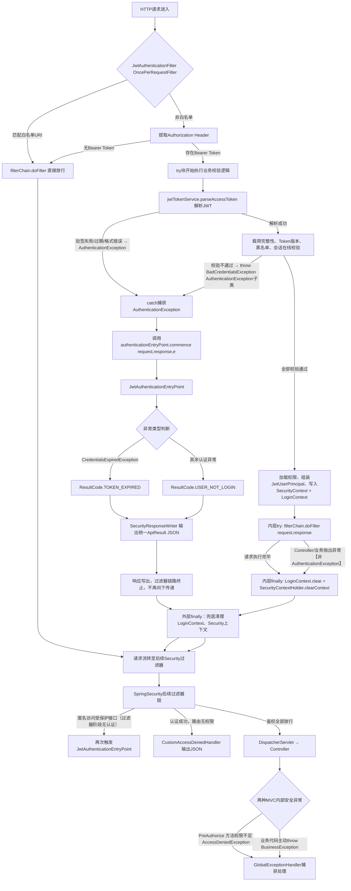

<h1><center>系统异常体系实现</center></h1>

# 一、核心设计目标和原则

> 场景：多租户越权、token 刷新、登出、`RBAC` 权限拦截、体测业务校验全部复用这套异常

## 1.1 概述

系统异常分为两大层级：

1. `Servlet Filter` 层（`SpringSecurity` 过滤器链）：认证阶段、`JWT`解析阶段。早于 `MVC` 流程，**全局 `@RestControllerAdvice` 捕获不到**，必须在过滤器内手动捕获、输出 `JSON` 响应；
2. `SpringMVC Controller` 层：由 `@RestControllerAdvice` 统一接管。

## 1.2 设计目标

- 解决 `SpringSecurity` 原生 401/403 英文默认返回、页面返回、杂乱格式问题。
- 所有认证/授权异常 **全部返回统一 `ApiResult JSON`**。
- 区分：Token异常、未登录异常、权限不足异常、业务异常。
- 保证过滤器链路不抛异常、不中断栈、性能更优。
- 与全局异常处理器形成双层闭环，覆盖系统 **100% 异常场景**。

## 1.3 异常链路分层

### 1.3.1 链路边界说明

1. **Filter 阶段 = 未进入 `SpringMVC`**

   `JWT` 过滤器、Security 原生过滤器执行时机在 `DispatcherServlet` 之前。

   因此：

   - **Token 过期、Token 无效、版本不匹配、刷新令牌失效**：无法进入全局异常处理器。
   - **匿名访问、未登录**：路由拦截，未进 Controller。
   - **路由级别权限不足**：过滤器链拦截，未进 Controller。

2. **`MVC`** **阶段 = 已进入** **Controller**

   方法级注解 `@PreAuthorize`、业务校验、参数校验、租户越权等，可被全局异常捕获。

### 1.3.2 三类异常处理入口

| 异常场景                              | 处理类                                                   | 所处阶段         | 是否走全局异常 |
| :------------------------------------ | :------------------------------------------------------- | :--------------- | :------------- |
| `JWT`解析异常（过期、无效、版本错误） | `FilterExceptionWriter`（`JwtAuthenticationFilter`内部） | `Servlet Filter` | 否             |
| 未登录、无Token、认证失败             | `JwtAuthenticationEntryPoint`                            | Security Filter  | 否             |
| 路由级别权限不足 403                  | `JwtAccessDeniedHandler`                                 | Security Filter  | 否             |
| 方法级别 `@PreAuthorize` 权限不足     | `GlobalExceptionHandler`                                 | `SpringMVC`      | 是             |
| 业务异常、租户越权、参数错误          | `GlobalExceptionHandler`                                 | `SpringMVC`      | 是             |

# 二、`Spring MVC`层异常处理类设计

## 2.1 统一返回结果实体

```java
package com.wsw.fitnesssystem.shared.response;

import lombok.Data;
import lombok.NoArgsConstructor;

/**
 * 接口统一返回对象
 *
 * @author loriyuhv
 * @version 1.0 2026/1/14 18:10
 * @since 1.0
 */
@Data
@NoArgsConstructor
public class ApiResult<T> {
    /** HTTP 状态码 */
    private Integer httpCode;

    /** 业务状态码（前端识别） */
    private Integer bizCode;

    /** 提示信息 */
    private String message;

    /** 响应数据 */
    private T data;

    /** 时间戳 */
    private Long timestamp;

    /**
     * 私有全参构造，强制使用静态工厂方法构建实例
     * @param httpCode HTTP 状态码
     * @param bizCode 业务状态码
     * @param message 提示信息
     * @param data 响应数据
     * @param timestamp 时间戳
     */
    private ApiResult(Integer httpCode, Integer bizCode, String message, T data, Long timestamp) {
        this.httpCode = httpCode;
        this.bizCode = bizCode;
        this.message = message;
        this.data = data;
        this.timestamp = timestamp;
    }

    /* ================= 成功响应 ================= */

    public static <T> ApiResult<T> success() {
        return success(null);
    }

    public static <T> ApiResult<T> success(T data) {
        return from(ResultCode.SUCCESS, data);
    }

    public static <T> ApiResult<T> success(String message, T data) {
        return new ApiResult<>(
            ResultCode.SUCCESS.httpCode(),
            ResultCode.SUCCESS.getCode(),
            message, data,
            System.currentTimeMillis()
        );
    }

    /* ================= 失败响应 ================= */

    public static <T> ApiResult<T> error(ResultCode resultCode) {
        return from(resultCode, null);
    }

    public static <T> ApiResult<T> error(ResultCode resultCode, String message) {
        return from(resultCode, null, message);
    }

    /* ================= 核心工厂方法 ================= */

    public static <T> ApiResult<T> from(ResultCode resultCode, T data) {
        return new ApiResult<>(
            resultCode.httpCode(),
            resultCode.getCode(),
            resultCode.getMessage(),
            data,
            System.currentTimeMillis()
        );
    }

    public static <T> ApiResult<T> from(ResultCode resultCode, T data, String message) {
        return new ApiResult<>(
                resultCode.httpCode(),
                resultCode.getCode(),
                message,
                data,
                System.currentTimeMillis()
        );
    }
}

```

## 2.2 全局错误码枚举

```java
package com.wsw.fitnesssystem.shared.response;

import lombok.Getter;
import org.springframework.http.HttpStatus;

/**
 * 接口统一返回状态码
 * 规则：
 *  - code：业务状态码（前端识别）
 *  - httpStatus：HTTP 状态
 *  - message：默认提示信息
 * 编码规范：
 *  200xxx  成功
 *  400xxx  参数 / 请求错误
 *  401xxx  认证 / Token
 *  403xxx  权限
 *  404xxx  数据不存在
 *  500xxx  系统错误
 *  600xxx  外部 / 内部接口调用
 *
 * @author loriyuhv
 * @version 1.0 2026/1/14 18:12
 * @since 1.0
 */
@Getter
public enum ResultCode {

    /* ================= 成功 ================= */
    SUCCESS(200000, HttpStatus.OK, "操作成功"),
    LOGOUT_SUCCESS(200101, HttpStatus.OK, "用户登出成功"),
    KICKOUT_SUCCESS(200102, HttpStatus.OK, "用户被踢出成功"),

    /* ================= 参数 / 请求错误 400xxx ================= */
    PARAM_INVALID(400001, HttpStatus.BAD_REQUEST, "参数不合法"),
    PARAM_MISSING(400002, HttpStatus.BAD_REQUEST, "参数缺失"),
    PARAM_TYPE_ERROR(400003, HttpStatus.BAD_REQUEST, "参数类型错误"),
    REQUEST_FORMAT_ERROR(400004, HttpStatus.BAD_REQUEST, "请求格式错误"),

    /* ================= 认证 / 登录 401xxx ================= */
    USER_NOT_LOGIN(401001, HttpStatus.UNAUTHORIZED, "用户未登录"),
    USER_LOGIN_ERROR(401002, HttpStatus.UNAUTHORIZED, "账号或密码错误"),
    // 和SpringSecurity的BadCredentialsException语义相同
    PASSWORD_ERROR(401003, HttpStatus.UNAUTHORIZED, "密码错误"),
    TOKEN_EXPIRED(401101, HttpStatus.UNAUTHORIZED, "Token已过期"),
    TOKEN_INVALID(401102, HttpStatus.UNAUTHORIZED, "Token无效"),
    TOKEN_SIGNATURE_ERROR(401103, HttpStatus.UNAUTHORIZED, "Token签名错误"),
    TOKEN_MALFORMED(401104, HttpStatus.UNAUTHORIZED, "Token格式错误"),
    REFRESH_TOKEN_EXPIRED(401105, HttpStatus.UNAUTHORIZED, "RefreshToken已过期"),
    REFRESH_TOKEN_INVALID(401106, HttpStatus.UNAUTHORIZED, "RefreshToken无效"),

    /* ================= 权限 / 访问控制 403xxx ================= */
    PERMISSION_DENIED(403001, HttpStatus.FORBIDDEN, "权限不足"),
    ROLE_NOT_ASSIGNED(403002, HttpStatus.FORBIDDEN, "未分配角色"),
    ACCOUNT_DISABLED(403003, HttpStatus.FORBIDDEN, "账号已被禁用"),
    ACCOUNT_LOCKED(403004, HttpStatus.FORBIDDEN, "账号已被锁定"),
    PERMISSION_EXPIRED(403005, HttpStatus.FORBIDDEN, "权限已过期"),

    /* ================= 数据不存在 404xxx ================= */
    USER_NOT_EXIST(404001, HttpStatus.NOT_FOUND, "用户不存在"),
    ACCOUNT_NOT_EXIST(404002, HttpStatus.NOT_FOUND, "账号不存在"),
    FITNESS_DATA_NOT_FOUND(404101, HttpStatus.NOT_FOUND, "体测数据不存在"),

    /* ================= 业务冲突 / 状态异常 409xxx ================= */
    USER_ALREADY_EXIST(409001, HttpStatus.CONFLICT, "用户已存在"),
    ACCOUNT_ALREADY_EXIST(409002, HttpStatus.CONFLICT, "账号已存在"),
    FITNESS_DATA_ALREADY_EXIST(409101, HttpStatus.CONFLICT, "体测数据已存在"),

    /* ================= 体测业务错误 422xxx ================= */
    FITNESS_SCORE_CALCULATE_ERROR(422101, HttpStatus.UNPROCESSABLE_ENTITY, "成绩计算失败"),
    FITNESS_DATA_IMPORT_ERROR(422102, HttpStatus.UNPROCESSABLE_ENTITY, "体测数据导入失败"),
    FITNESS_DATA_EXPORT_ERROR(422103, HttpStatus.UNPROCESSABLE_ENTITY, "体测数据导出失败"),

    /* ================= 系统错误 500xxx ================= */
    SYSTEM_ERROR(500000, HttpStatus.INTERNAL_SERVER_ERROR, "系统异常"),
    DATABASE_ERROR(500001, HttpStatus.INTERNAL_SERVER_ERROR, "数据库操作异常"),
    CACHE_ERROR(500002, HttpStatus.INTERNAL_SERVER_ERROR, "缓存服务异常"),
    FILE_UPLOAD_ERROR(500003, HttpStatus.INTERNAL_SERVER_ERROR, "文件上传失败"),
    FILE_DOWNLOAD_ERROR(500004, HttpStatus.INTERNAL_SERVER_ERROR, "文件下载失败"),
    LOGOUT_FAILED(500101, HttpStatus.INTERNAL_SERVER_ERROR, "用户登出失败"),
    KICKOUT_FAILED(500102, HttpStatus.INTERNAL_SERVER_ERROR, "用户被踢出失败"),

    /* ================= 接口 / 第三方调用 600xxx ================= */
    INNER_INTERFACE_ERROR(600001, HttpStatus.INTERNAL_SERVER_ERROR, "内部系统接口调用异常"),
    OUTER_INTERFACE_ERROR(600002, HttpStatus.BAD_GATEWAY, "外部系统接口调用异常"),
    INTERFACE_FORBIDDEN(600003, HttpStatus.FORBIDDEN, "接口禁止访问"),
    INTERFACE_ADDRESS_INVALID(600004, HttpStatus.BAD_REQUEST, "接口地址无效"),
    INTERFACE_TIMEOUT(600005, HttpStatus.GATEWAY_TIMEOUT, "接口请求超时");

    /** 业务状态码 */
    private final Integer code;
    /** HTTP 状态 */
    private final HttpStatus httpStatus;
    /** 默认提示信息 */
    private final String message;

    ResultCode(Integer code, HttpStatus httpStatus, String message) {
        this.code = code;
        this.httpStatus = httpStatus;
        this.message = message;
    }

    public int httpCode() {
        return httpStatus.value();
    }
}

```

## 2.3 自定义异常基类

> 所有自定义异常父类

```java
package com.wsw.fitnesssystem.shared.exception;

import lombok.Getter;
import com.wsw.fitnesssystem.shared.response.ResultCode;

/**
 * 异常基类
 * - 所有自定义异常的父类
 * - 不关心 HTTP、Controller、接口协议
 * - 只承载“错误语义”
 *
 * @author loriyuhv
 * @version 1.0 2026/1/14 22:55
 * @since 1.0
 */
@Getter
public abstract class BaseException extends RuntimeException {
    protected final ResultCode resultCode;

    protected BaseException(ResultCode resultCode) {
        super(resultCode.getMessage());
        this.resultCode = resultCode;
    }

    protected BaseException(ResultCode resultCode, Throwable cause) {
        super(resultCode.getMessage(), cause);
        this.resultCode = resultCode;
    }
}

```

## 2.4 自定义业务异常类

```java
package com.wsw.fitnesssystem.shared.exception;

import com.wsw.fitnesssystem.shared.response.ResultCode;

/**
 * 业务异常
 * - 用于参数校验失败、状态不合法、权限不足等
 * - 语义：请求合法，但业务不成立
 *
 * @author loriyuhv
 * @version 1.0 2026/1/14 22:55
 * @since 1.0
 */
public class BizException extends BaseException {
    public BizException(ResultCode resultCode) {
        super(resultCode);
    }

    public BizException(ResultCode resultCode, Throwable cause) {
        super(resultCode, cause);
    }
}

```

## 2.5 自定义系统异常类

```java
package com.wsw.fitnesssystem.shared.exception;

import com.wsw.fitnesssystem.shared.response.ResultCode;

/**
 * 系统异常（兜底）
 * - 用于不可预期错误：DB、IO、第三方接口
 * - 一般不会主动 throw，而是包装
 *
 * @author loriyuhv
 * @version 1.0 2026/1/14 22:55
 * @since 1.0
 */
public class SystemException extends BaseException {
    public SystemException(ResultCode resultCode, Throwable cause) {
        super(resultCode, cause);
    }
}

```

## 2.6 SpringMVC 全局异常处理器

```java
package com.wsw.fitnesssystem.shared.exception;

import lombok.extern.slf4j.Slf4j;
import com.wsw.fitnesssystem.shared.response.ApiResult;
import com.wsw.fitnesssystem.shared.response.ResultCode;
import org.springframework.security.access.AccessDeniedException;
import org.springframework.security.authorization.AuthorizationDeniedException;
import org.springframework.web.bind.annotation.ExceptionHandler;
import org.springframework.web.bind.annotation.RestControllerAdvice;

/**
 * 全局异常处理器
 * - 负责将异常 → HTTP 响应
 * - 是“异常的最后一站”
 *
 * @author loriyuhv
 * @version 1.0 2026/1/14 18:23
 * @since 1.0
 */
@Slf4j
@RestControllerAdvice
public class GlobalExceptionHandler {
    /**
     * 业务异常 → 400
     */
    @ExceptionHandler(BizException.class)
    public ApiResult<Object> handleBizException(BizException e) {
        ResultCode rc = e.getResultCode();
        log.warn("业务异常: {}", rc.getMessage());
        return ApiResult.error(rc);
    }

    /**
     * 系统异常 → 500
     */
    @ExceptionHandler(SystemException.class)
    public ApiResult<Object> handleSystemException(SystemException e) {
        ResultCode rc = e.getResultCode();
        log.error("系统异常: {}", rc.getMessage(), e);
        return ApiResult.error(rc);
    }

    /**
     * 权限不足 → 403
     */
    @ExceptionHandler({AuthorizationDeniedException.class, AccessDeniedException.class})
    public ApiResult<Object> handleAccessDeniedException(Exception e) {
        log.warn("权限异常: {}", e.getMessage());
        return ApiResult.error(ResultCode.PERMISSION_DENIED);
    }

    /**
     * 未捕获异常 → 系统兜底
     */
    @ExceptionHandler(Exception.class)
    public ApiResult<Object> handleUnknownException(Exception e) {
        log.error("未知异常", e);
        return ApiResult.error(ResultCode.SYSTEM_ERROR);
    }
}

```

# 三、`Servlet Filter` 层异常处理类设计

## 3.1 SpringSecurity配置自定义异常

```java
// 在Spring Security配置类的filterChain方法配置
// 配置自定义处理异常类
http.exceptionHandling(
  exception -> exception
  .authenticationEntryPoint(jwtAuthenticationEntryPoint)  // 认证失败（401）
  .accessDeniedHandler(jwtAccessDeniedHandler)            // 授权失败（403）
)
```

## 3.2 过滤器统一异常输出工具类

```java
package com.wsw.fitnesssystem.auth.infrastructure.security.support;

import com.fasterxml.jackson.databind.ObjectMapper;
import com.wsw.fitnesssystem.shared.response.ApiResult;
import com.wsw.fitnesssystem.shared.response.ResultCode;
import jakarta.servlet.http.HttpServletResponse;
import lombok.RequiredArgsConstructor;
import org.springframework.http.MediaType;
import org.springframework.stereotype.Component;

import java.io.IOException;
import java.nio.charset.StandardCharsets;

/**
 * Security模块统一响应输出工具
 * <li>收拢过滤器、安全处理器内JSON响应输出逻辑，消除重复Header设置、序列化代码</li>
 * <li>统一使用项目标准 {@link ApiResult} 返回结构，保证前后端格式一致</li>
 * <li>复用全局ObjectMapper，序列化行为与Controller层保持统一</li>
 * 注意：仅用于Security Filter链内组件输出响应，不要在Controller中使用
 * @author loriyuhv
 * @version 1.0 2026/1/15 0:18
 * @since 1.0
 */
@Component
@RequiredArgsConstructor
public class SecurityResponseWriter {

    private final ObjectMapper objectMapper;

    /**
     * 根据错误码输出标准失败响应，使用ResultCode内置提示信息
     * @param response http响应对象
     * @param resultCode 业务结果码
     * @throws IOException 输入输出异常
     */
    public void write(HttpServletResponse response, ResultCode resultCode) throws IOException {
        write(response, resultCode, resultCode.getMessage());
    }

    /**
     * 根据错误码 + 自定义消息输出响应
     * @param response http响应对象
     * @param resultCode 业务结果状态码
     * @param message 自定义提示文本
     * @throws IOException 输入输出异常
     */
    public void write(
        HttpServletResponse response,
        ResultCode resultCode,
        String message
    ) throws IOException {

        response.setStatus(resultCode.getHttpStatus().value());
        response.setContentType(MediaType.APPLICATION_JSON_VALUE);
        response.setCharacterEncoding(StandardCharsets.UTF_8.name());
        ApiResult<Object> result;
        if (message != null && !message.isBlank()) {
            result = ApiResult.error(resultCode, message);
        } else {
            result = ApiResult.error(resultCode);
        }
        objectMapper.writeValue(response.getWriter(), result);
    }
}

```


## 3.3 认证异常处理类

```java
package com.wsw.fitnesssystem.auth.authentication.infrastructure.security.handler;

import com.wsw.fitnesssystem.auth.authentication.infrastructure.security.support.SecurityResponseWriter;
import com.wsw.fitnesssystem.shared.response.ResultCode;
import jakarta.servlet.http.HttpServletRequest;
import jakarta.servlet.http.HttpServletResponse;
import lombok.RequiredArgsConstructor;
import lombok.extern.slf4j.Slf4j;
import org.springframework.security.authentication.CredentialsExpiredException;
import org.springframework.security.core.AuthenticationException;
import org.springframework.security.web.AuthenticationEntryPoint;
import org.springframework.stereotype.Component;

import java.io.IOException;

/**
 * JWT认证失败处理器
 * 触发时机：
 * - 请求未携带 Token
 * - Token 已过期 / 非法 / 签名错误
 * - 当前请求需要认证，但 SecurityContext 中无 Authentication
 * 设计原则：
 * - 不抛异常（Filter 链路已终止）
 * - 不进入 Controller / GlobalExceptionHandler
 * - 只负责将认证异常转换为统一的接口响应格式
 * 返回结果：
 * - HTTP Status：401
 * - 业务状态码：{@link ResultCode#USER_NOT_LOGIN}
 *
 * @author loriyuhv
 * @version 1.0 2026/1/14 23:53
 * @since 1.0
 */
@Slf4j
@Component
@RequiredArgsConstructor
public class JwtAuthenticationEntryPoint implements AuthenticationEntryPoint {
    /** Spring 管理的单例 */
    private final SecurityResponseWriter securityResponseWriter;

    @Override
    public void commence(
        HttpServletRequest request,
        HttpServletResponse response,
        AuthenticationException authException
    ) throws IOException {

        ResultCode resultCode = authException instanceof CredentialsExpiredException
            ? ResultCode.TOKEN_EXPIRED
            : ResultCode.USER_NOT_LOGIN;

        // 记录安全日志（WARN级别）
        log.warn("认证失败，访问未授权资源: {}，Exception：{}",
            request.getRequestURI(),
            authException.getMessage()
        );

        // 写入响应
        securityResponseWriter.write(response, resultCode);
    }
}

```

## 3.4 Filter内权限不足处理器

```java
package com.wsw.fitnesssystem.auth.authentication.infrastructure.security.handler;

import com.wsw.fitnesssystem.auth.authentication.infrastructure.security.support.SecurityResponseWriter;
import com.wsw.fitnesssystem.shared.response.ResultCode;
import jakarta.servlet.http.HttpServletRequest;
import jakarta.servlet.http.HttpServletResponse;
import lombok.RequiredArgsConstructor;
import lombok.extern.slf4j.Slf4j;
import org.springframework.security.access.AccessDeniedException;
import org.springframework.security.web.access.AccessDeniedHandler;
import org.springframework.stereotype.Component;

import java.io.IOException;

/**
 * JWT 过滤器链内权限不足处理器（403）
 * <p>【重要触发边界】仅处理 <b>Filter 链路内部</b>产生的 AccessDeniedException：
 * <li>1. SecurityFilterChain #authorizeHttpRequests 路径匹配鉴权失败</li>
 * <li>2. 自定义Filter中手动抛出 AccessDeniedException</li>
 * <p>⚠️ 注意：Controller {@code @PreAuthorize} 方法鉴权失败属于AOP层异常，不会进入此类，由全局异常处理器捕获。
 *
 * <p>触发前提：Token合法、用户认证成功（已登录），但是缺少访问资源所需角色/权限。
 * 响应规范：
 * <ul>
 *     <li>HTTP Status：403 FORBIDDEN</li>
 *     <li>业务码：{@link ResultCode#PERMISSION_DENIED}</li>
 * </ul>
 * @author loriyuhv
 * @version 1.0 2026/1/15 0:11
 * @since 1.0
 */
@Slf4j
@Component
@RequiredArgsConstructor
public class JwtAccessDeniedHandler implements AccessDeniedHandler {
    private final SecurityResponseWriter responseWriter;

    @Override
    public void handle(
        HttpServletRequest request,
        HttpServletResponse response,
        AccessDeniedException accessDeniedException
    ) throws IOException {

        ResultCode resultCode = ResultCode.PERMISSION_DENIED;
        log.warn("已认证用户访问受限资源，权限校验不通过 | URI: {} | 原因: {}",
            request.getRequestURI(),
            accessDeniedException.getMessage()
        );
        responseWriter.write(response, resultCode);
    }
}

```


# 四、异常流转流程

## 4.1 约定

**链路 A：`Servlet Filter` 阶段（`JWT 过滤器` / `Security原生过滤器`）**

发生时机：`DispatcherServlet` 之前，**不在 `SpringMVC` 上下文**

**链路 B：`SpringMVC` 链路（Controller、Service）**

发生时机：进入 `DispatcherServlet` 之后，`@RestControllerAdvice` 生效

## 4.2 流程图





# 五、异常处理

## 5.1 业务异常和系统异常

### 5.1.1 `IllegalArgumentException`举例

- 场景A：业务主动校验抛出 `IllegalArgumentException`（业务参数校验）

  ```java
  if(age < 0){
      throw new IllegalArgumentException("年龄不能为负数");
  }
  // 这里是**业务逻辑校验，属于用户输入错误**，属于 400xxx 范畴。
  // 可以把**自定义友好 message 返回前端**，**但是不要直接把原生异常栈、原生异常信息原样吐出**。
  // 对应枚举：`PARAM_INVALID(400001, "参数不合法")`，同时可以携带详细提示：`年龄不能为负数`。
  ```

- 场景B：底层框架、工具类、JDK 内部抛出的 IllegalArgumentException

  ```java
  // 比如集合、反射、工具类、EasyExcel、线程池内部抛出，**不是用户输入直接导致，是程序内部传参错误（bug）**。
  // ❌ **绝对不能把原始异常信息暴露给前端**，直接返回 `SYSTEM_ERROR(500000, "系统异常，请联系管理员")`，异常完整 message + 堆栈打日志。
  ```


